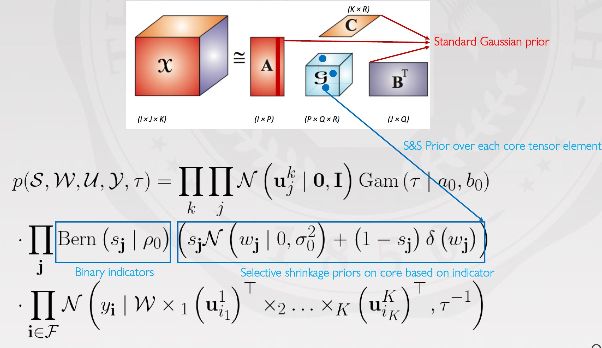

# Bayesian-streaming-sparse-tucker-decomposition
code of Bayesian streaming sparse tucker decomposition for UAI 2021

## Requirements:
matlab >= 2016

## Instructions:
1. Clone this repository.
2. See model details in `bayes_sparse_tucker_streaming_seq.m` .  Run model with `acc_script.m`,`alog_script.m`

## Datasets & Baselines
Large dataset:acc, small dataset:alog

Baselines: cp_als, cp_wopt, cp_num (you may have to modify the data-loding path to run baselines)

Check infos for more datasets and baselines in our paper

link to paper present will be release soon :)
